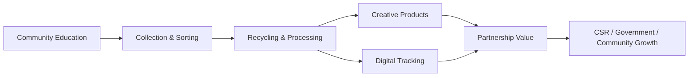

<div align="center">

# Baciraro


**A modern sustainability platform that connects education, collection, recycling, digital tracking, and circular value creation in one cohesive ecosystem.**

[](https://github.com)
[](https://nextjs.org)
[](https://react.dev)
[](https://www.typescriptlang.org)
[](https://tailwindcss.com)


<p>
	<a href="#project-overview">Overview</a> ·
	<a href="#the-problem">Problem</a> ·
	<a href="#the-solution">Solution</a> ·
	<a href="#how-it-works">How It Works</a> ·
	<a href="#key-features">Features</a> ·
	<a href="#technology-stack">Stack</a> ·
	<a href="#installation--setup">Install</a> ·
	<a href="#usage--examples">Usage</a> ·
	<a href="#deployment--configuration">Deploy</a>
</p>

</div>

---

## 📌 Project Overview

Baciraro is a product-style web platform designed to present a real-world waste management ecosystem in a clear, credible, and conversion-friendly way. It is built to communicate the value of the Baciraro network across business, government, community, and sustainability stakeholders.

The site showcases a complete ecosystem narrative: from education and waste collection to recycling, creative products, digital monitoring, and leadership branding. It is intentionally structured like a modern SaaS landing experience so it can support partnership conversations, public-facing credibility, and future growth.

## 🧩 The Problem

Waste management initiatives often struggle with the same challenge: the impact is real, but the story is fragmented.

Baciraro was created to address problems such as:

- scattered sustainability programs that are hard to explain to partners,
- weak visibility into process, impact, and accountability,
- limited digital presentation for CSR and public stakeholders,
- disconnected business units that operate without a unified ecosystem narrative.

In practice, this makes it harder to build trust, secure partnerships, and turn operational activity into visible value.

## ✅ The Solution

Baciraro solves that gap with a single, polished digital platform that presents the ecosystem as an integrated product.

It combines:

- a high-conviction brand story,
- clear section-based storytelling,
- leadership positioning through the CEO profile,
- ecosystem cards for each entity,
- measurable impact messaging,
- conversion-ready calls to action for partnerships and collaboration.

This makes Baciraro easier to understand, easier to present, and easier to support.

## 🔄 How It Works

The experience is structured as a guided narrative:

1. The hero section introduces Baciraro as a modern sustainability platform.
2. The CEO section builds trust by highlighting leadership and credibility.
3. The About section explains the mission and ecosystem scope.
4. The ecosystem section maps each operational unit and its role.
5. The flow section visualizes the journey from waste to value.
6. The impact and services sections translate the ecosystem into outcomes and collaboration opportunities.
7. The contact section gives stakeholders a clear next step.



## ✨ Key Features

| Feature | Benefit |
| --- | --- |
| Hero-led storytelling | Creates a strong first impression for stakeholders and partners |
| CEO spotlight | Adds leadership credibility and brand trust |
| Ecosystem cards | Makes each business unit easy to understand |
| Impact section | Turns sustainability into measurable business value |
| Service positioning | Speaks directly to CSR, government, and village collaboration |
| Responsive layout | Works cleanly across desktop, tablet, and mobile |
| Motion-driven UI | Feels modern and premium without losing clarity |
| Modular page sections | Easy to extend as the ecosystem grows |

## 🛠 Technology Stack

| Layer | Technology | Purpose |
| --- | --- | --- |
| Frontend framework | Next.js 16.2.4 | App routing, rendering, and production deployment |
| UI library | React 19.2.4 | Component-driven interface architecture |
| Language | TypeScript 5 | Type safety and maintainability |
| Styling | Tailwind CSS 4 | Fast, consistent, responsive design |
| Animation | Framer Motion | Page transitions and section reveals |
| Icons | Lucide React | Lightweight iconography |
| Tooling | ESLint 9 | Code quality and consistency |

## 🚀 Installation & Setup

### Prerequisites

- Node.js 20+ recommended
- npm, pnpm, yarn, or bun

### Install dependencies

```bash
npm install
```

### Environment variables

Create a `.env.local` file in the project root if you want to customize runtime values:

```bash
NEXT_PUBLIC_SITE_URL=http://localhost:3000
NEXT_PUBLIC_CONTACT_EMAIL=halo@baciraro.id
NEXT_PUBLIC_WHATSAPP_NUMBER=+62XXXXXXXXXXX
```

> Note: this project currently works without mandatory environment variables. The values above are recommended if you want to wire in deployment URLs or contact integrations later.

### Run locally

```bash
npm run dev
```

Open [http://localhost:3000](http://localhost:3000) in your browser.

### Production build

```bash
npm run build
npm run start
```

## 👀 Usage & Examples

The homepage is designed as a single, high-signal marketing experience. Users can scroll through the story or jump directly to important sections using the navigation.

Common interactions:

- open the CEO profile from the hero or CEO section,
- explore each ecosystem entity through its dedicated page,
- review the operational flow to understand the circular model,
- use the contact CTA to initiate collaboration.

Example navigation pattern in the app:

```tsx
import Link from "next/link";

export function PrimaryCTA() {
	return (
		<Link href="/projects" className="rounded-full bg-emerald-500 px-5 py-3 font-semibold text-white">
			Explore Projects
		</Link>
	);
}
```

## 💻 API Examples or Code Examples

Baciraro is currently a content-first website and does not expose a public API yet. However, the project is built in a way that makes future API integration straightforward.

Example: reusing a section card from the homepage data model.

```tsx
type EcosystemCard = {
	name: string;
	href: string;
	description: string;
};

const card: EcosystemCard = {
	name: "Trash Recycle Center",
	href: "/trashrecyclecenter",
	description: "A recycling unit focused on plastic, paper, and metal recovery.",
};

export function EcosystemLink() {
	return (
		<a href={card.href} className="block rounded-2xl border p-5 transition hover:shadow-lg">
			<h3 className="text-lg font-semibold">{card.name}</h3>
			<p className="mt-2 text-sm text-slate-600">{card.description}</p>
		</a>
	);
}
```

If you later connect Baciraro to a backend or CMS, a typical request pattern may look like this:

```bash
curl https://api.baciraro.id/v1/impact
```

Example response:

```json
{
	"totalWasteManaged": "1200+ tons",
	"activeCommunities": 80,
	"digitalProjects": 25,
	"status": "active"
}
```

## ⚙️ Deployment & Configuration

### Recommended deployment

The easiest deployment path is Vercel, which is the natural fit for a Next.js app.

1. Push the repository to GitHub.
2. Import the project into Vercel.
3. Add any environment variables from `.env.local`.
4. Deploy the production branch.

### Alternative deployment options

- Node.js server with `npm run build` and `npm run start`
- Docker-based hosting for controlled infrastructure
- Any platform that supports modern Next.js applications

### Suggested runtime configuration

```bash
NODE_ENV=production
NEXT_PUBLIC_SITE_URL=https://baciraro.id
```

## 🤝 Contributing

Contributions are welcome, especially if they improve clarity, content quality, ecosystem storytelling, accessibility, or performance.

Suggested workflow:

1. Fork the repository.
2. Create a feature branch.
3. Make your changes with focused commits.
4. Run lint and build checks.
5. Open a pull request with a clear summary.

```bash
npm run lint
npm run build
```

## 📄 License

This project is distributed under the MIT License unless otherwise specified by the repository owner.

You may adapt and extend it for your own organizational or product use, provided the license terms are respected.

---

<div align="center">

**Baciraro** is built to turn sustainability into a story people can trust, understand, and support.

If you are a partner, stakeholder, or contributor, this platform is designed to make the next conversation easier.

</div>
